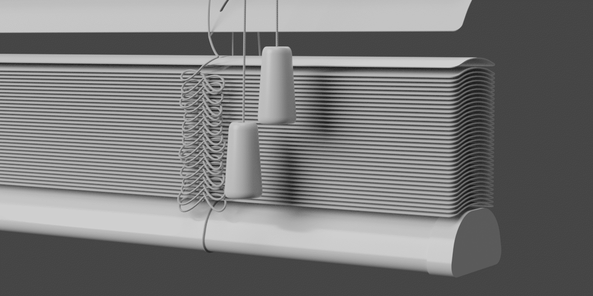
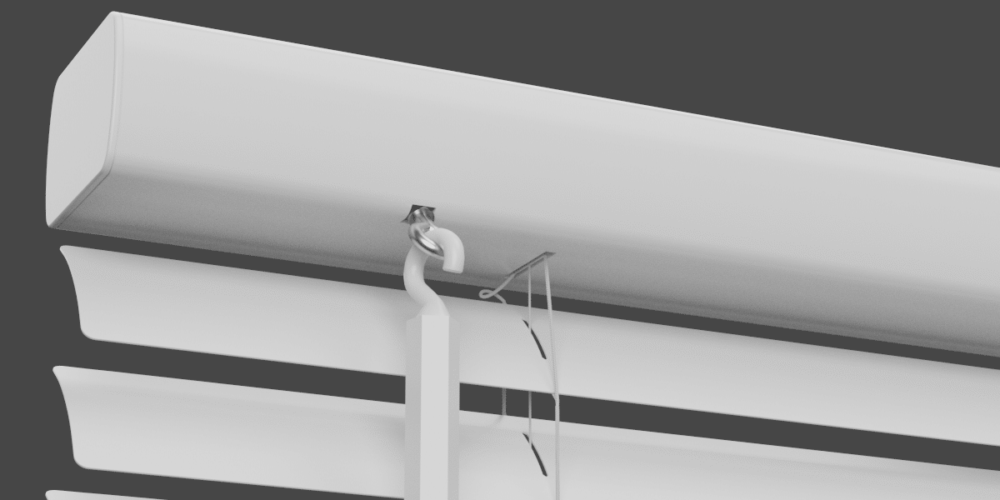
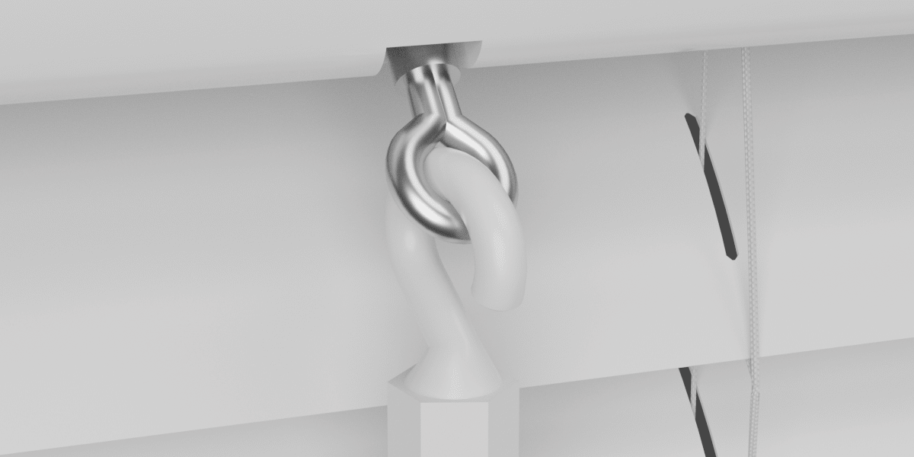

Settings - Controls
====

|

Objects
~~~~

Tassel Object
----

Load in the tassel object.

|

Wand Object
----

Load in the wand object.

|

Wand Mount Object
----

Load in the wand mount object.

|

Wand Dimensions
~~~~

Wand Offset
----

Offset the position of the wand.

|

Wand Mount Tilt
----

Set the angle of the wand mount.

|

Wand Length
----

Set the length of the wand.

|

Pull 1 Dimensions (Lift)
~~~~

Pull 1 Offset
----

Offset the lift control pull.

|

Pull 1 Length
----

Length of the lift control cord.

|

Pull 1 Cord Angle
----

Offset the angle that the cord comes out of the headrail.

|

Pull 1 Range
----

Adjust the range of motion that the pull cord moves as the blind is raised.

|

Pull 1 End Offset
----

Offset the position of the tassels of the lift control pull.

|

Pull 2 Dimensions (Tilt)
~~~~

Pull 2 Offset
----

Offset the position of the tilt control pull. This also serves as the basis for the position of the wand.

|

Pull 2 Length
----

Length of the tilt control cord.

|

Pull 2 End Offset
----

Offset the position of the tassels of the tilt control pull.

|

Pull 2 Cord Angle
----

Offset the angle that the cord comes out of the headrail.

|

Pull 2 Range
----

Adjust the range of motion that the tilt cord moves as the blind is tiled.

|

