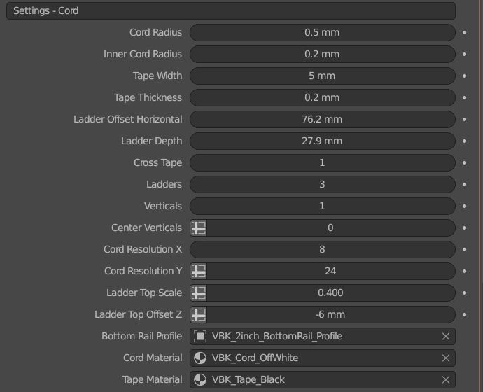
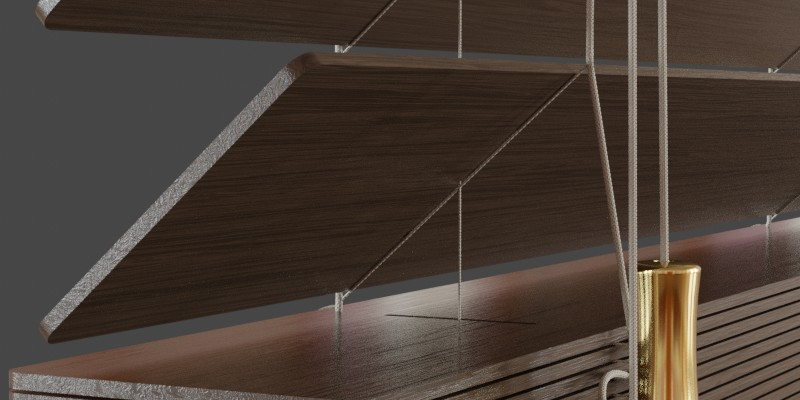
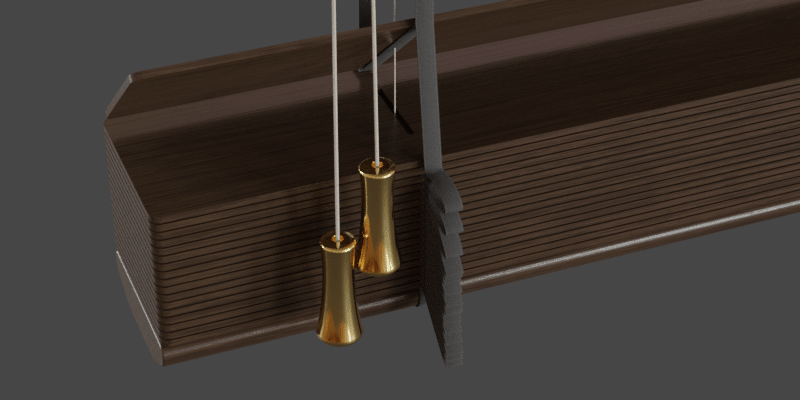
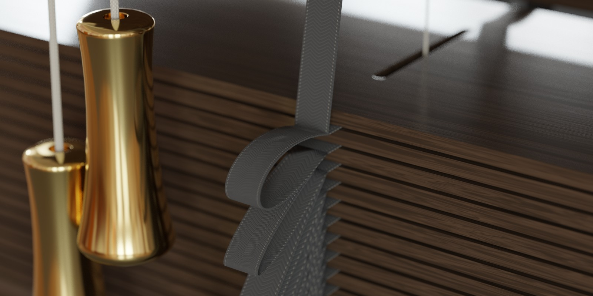
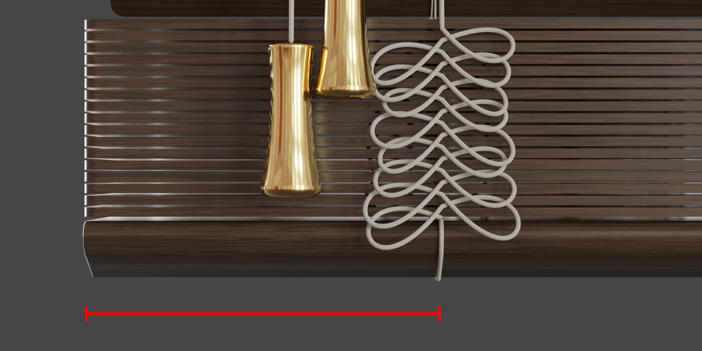
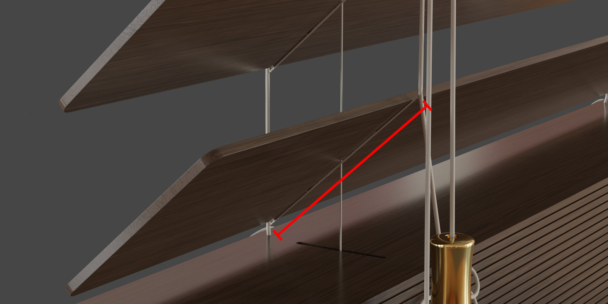
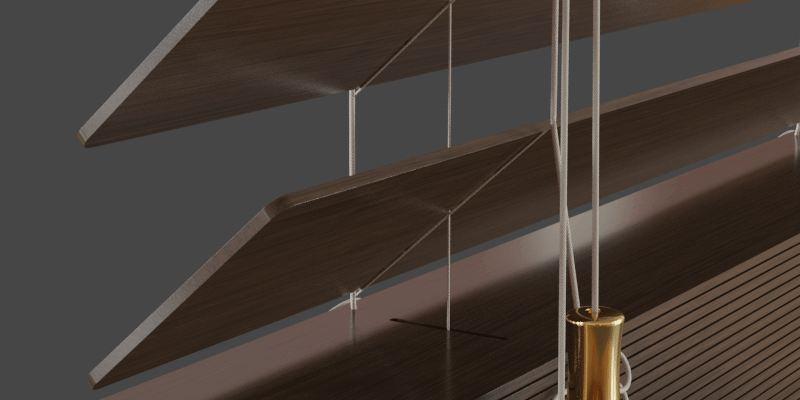
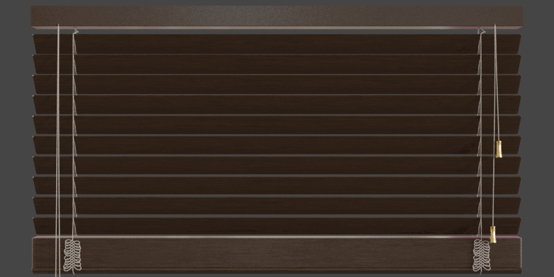
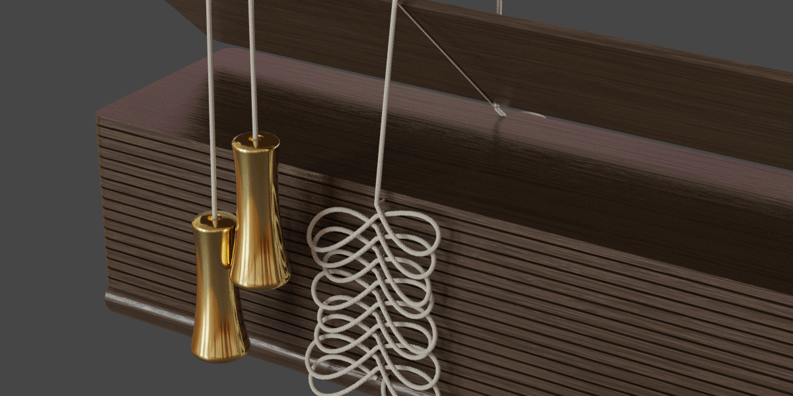
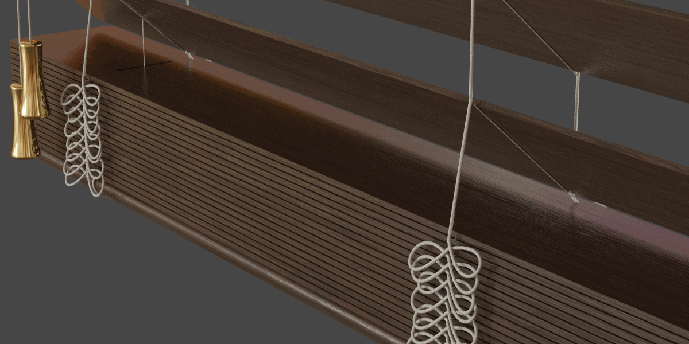

Settings - Cord
====

|

Cord Dimensions
~~~~

Cord Radius
----

This value sets the radius of the cord that is at the outside of the ladder.

.. image:: img/VBK_CordRadius.gif

|

Inner Cord Radius
----

This value sets the radius of the internal cord (vertical and cross).

|

Tape Width
----

Value for the width of the ladder tape. 

|

Tape Thickness
----

Value for the thickness of the ladder tape.

|

Ladder Offset Horizontal
----

The distance from the outside edge of the blinds to the ladder.

|

Ladder Depth
----

The depth of the ladder. Set this value to the depth of the slat plus some extra for movement.

|

Cord Settings
~~~~

Cross Tape
----

Toggle whether the cross cord is tape or cord.

|

Ladders
----

The number of ladders in the blind.

|

Verticals
----

Turn on and off the vertical cords.

|

Center Verticals
----

Some blind designs only have the vertical lines on the outside ladders. This affects whether the center holes are punched in the slats as well.

|

Cord Tweaks
~~~~

Cord Resolution X
----

The number of segments around the cord profile.

|

Cord Resolution Y
----

The number of segments along the cord between each slat.

|

Ladder Top Scale
----

Taper the top of the ladder to guide it into the headrail.

|

Ladder Top Offset Z
----

Offset the top of the ladder into the hole in the headrail. This helps when changing the distance between the top slat and the headrail or to control overshoot.

|

Bottom Rail Profile
----

This curve is used to add the cord around the bottom rail.

|

Cord Materials
~~~~

Cord Material
----

Material used for all the cord in the blind.

|

Tape Material
----

Material used for the tape in the blind.

|

