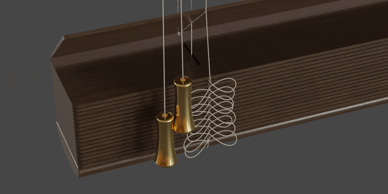

Settings - Cord
====

.. image:: img/VBK_Cord.jpg

|

Cord Dimensions
~~~~

Cord Radius
----

|

Inner Cord Radius
----

.. image:: img/VBK_CordRadius2.jpg

|

Tape Width
----

.. image:: img/VBK_TapeWidth.gif

|

Tape Thickness
----

|

Ladder Offset Horizontal
----

|

Ladder Depth
----

.. image:: img/VBK_LadderDepth.jpg

|

Cord Settings
~~~~

Cross Tape
----

|

Ladders
----

|

Verticals
----

|

Center Verticals
----

|

Cord Tweaks
~~~~

Cord Resolution X
----

|

Cord Resolution Y
----

|

Ladder Top Scale
----

|

Ladder Top Offset Z
----

|

Bottom Rail Profile
----

|

Cord Materials
~~~~

Cord Material
----

|

Tape Material
----

|

