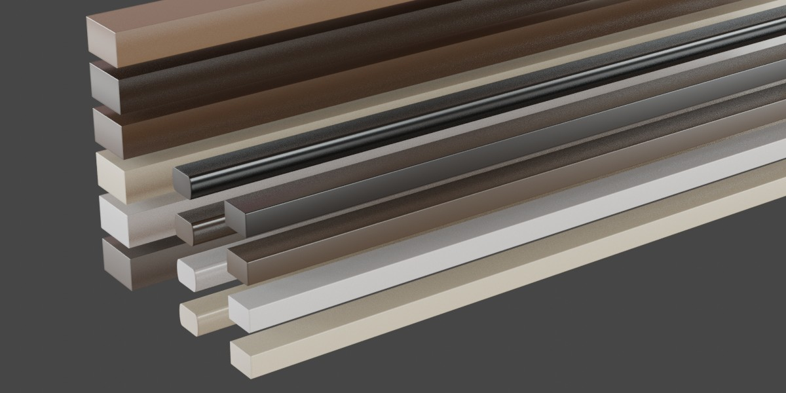
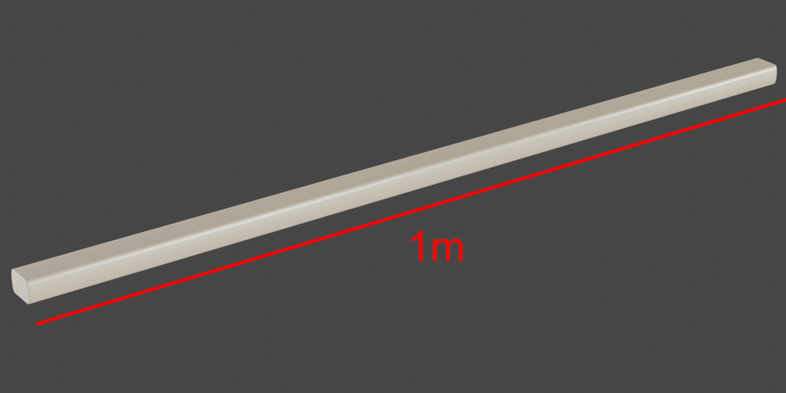
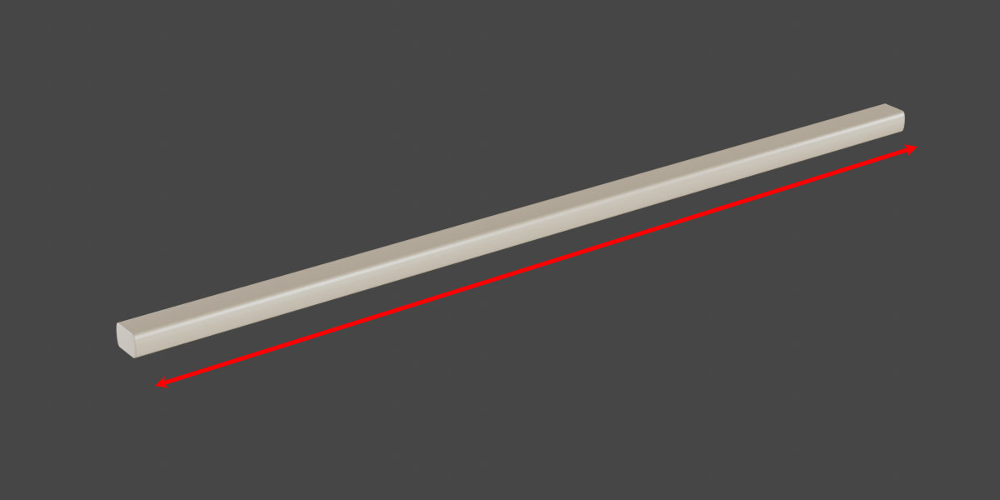
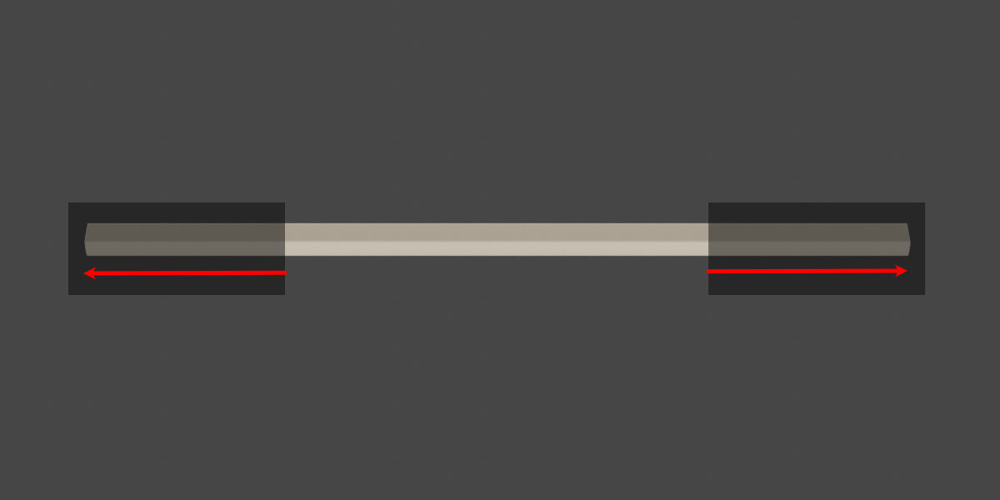
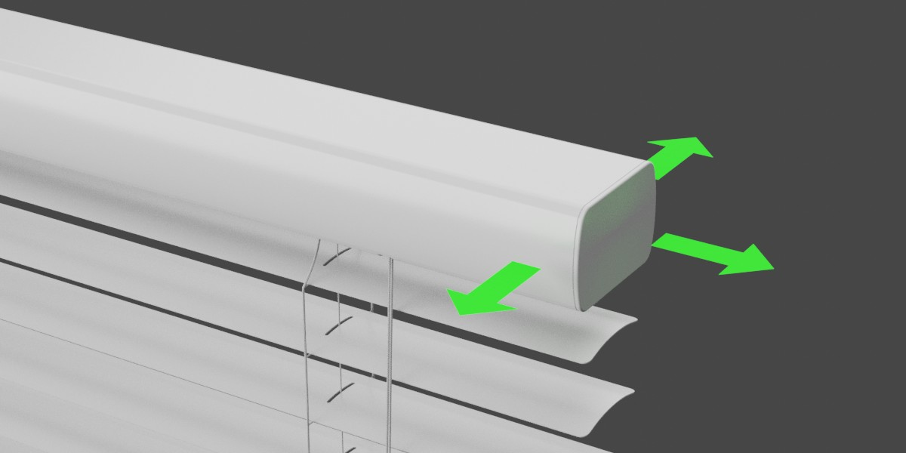
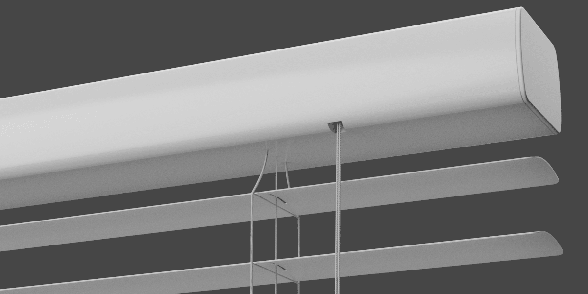
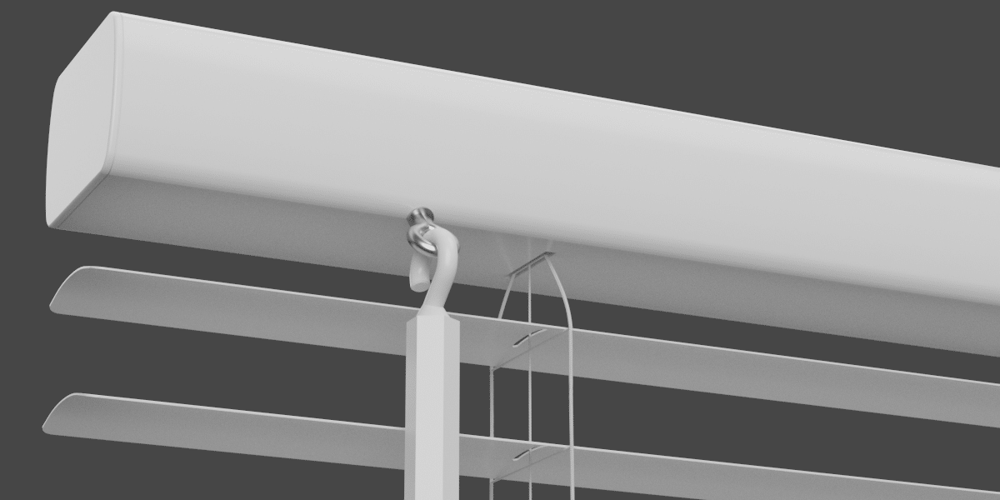

Settings - Headrail
====

|

Headrail Dimensions
~~~~

Headrail Object
----

The headrail object loaded into the blind assembly.

|

Headrail Base Width
----

Enter the blind width that the headrail object was designed for.

|

Headrail Extend
----

Turn on or off whether the headrail extends with the blind assembly. You may want to turn this off if you modeled a headrail to precise measurements and wish to maintain the original scale.

|

Headrail Cutoff
----

This is the exact point measured from the center that you want to have the headrail object extend from.

|

Headrail Offset
----

Offset the position of the headrail. This helps if your headrail object doesn't align with the assembly.

|

Headrail Cord Cutout Settings
~~~~

Headrail Cord Cutout
----

Toggle whether holes are cut into the headrail object for ladder cord to enter.

|

Headrail Cord Cutout Size
----

Set the dimensions of the ladder cutout.

|

Headrail Cord Cutout Offset
----

Offset the ladder cutout.

|

Headrail Lift Cutout Settings
~~~~

Headrail Lift Cutout
----

Toggle the headrail cutout for the lift control.

|

Headrail Lift Cutout Size
----

Set the dimensions of the lift control cutout.

|

Headrail Lift Cutout Offset
----

Offset the lift control cutout.

|

Headrail Tilt Cutout Settings
~~~~

Headrail Tilt Cutout
----

Toggle the headrail cutout for the tilt control.

|

Headrail Tilt Cutout Size
----

Set the dimensions of the tilt control cutout.

|

Headrail Tilt Cutout Offset
----

Offset the tilt control cutout.

|

