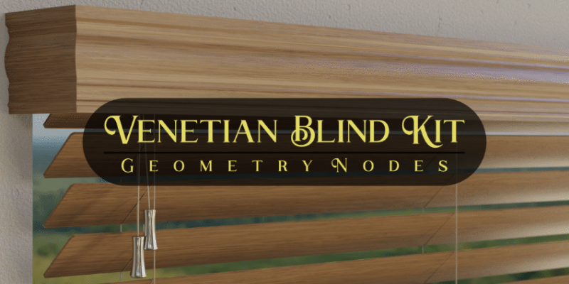

Welcome to Venetian Blind Kit documentation!
====

Venetian Blind Kit is a generator and library of venetian blinds and mini blinds built using the power and flexibility of geometry nodes.

|

Requirements
~~~~
**Blender 3.4 or newer**

|

.. toctree::
   :maxdepth: 4
   :hidden:
   :caption: Introduction
   
   usage
   

.. toctree::
   :maxdepth: 4
   :hidden:
   :caption: Advanced Settings
   
   slats
