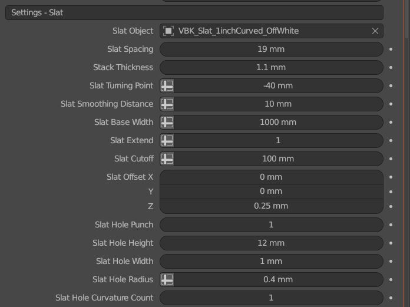
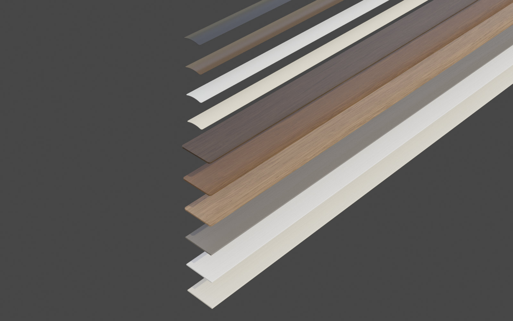
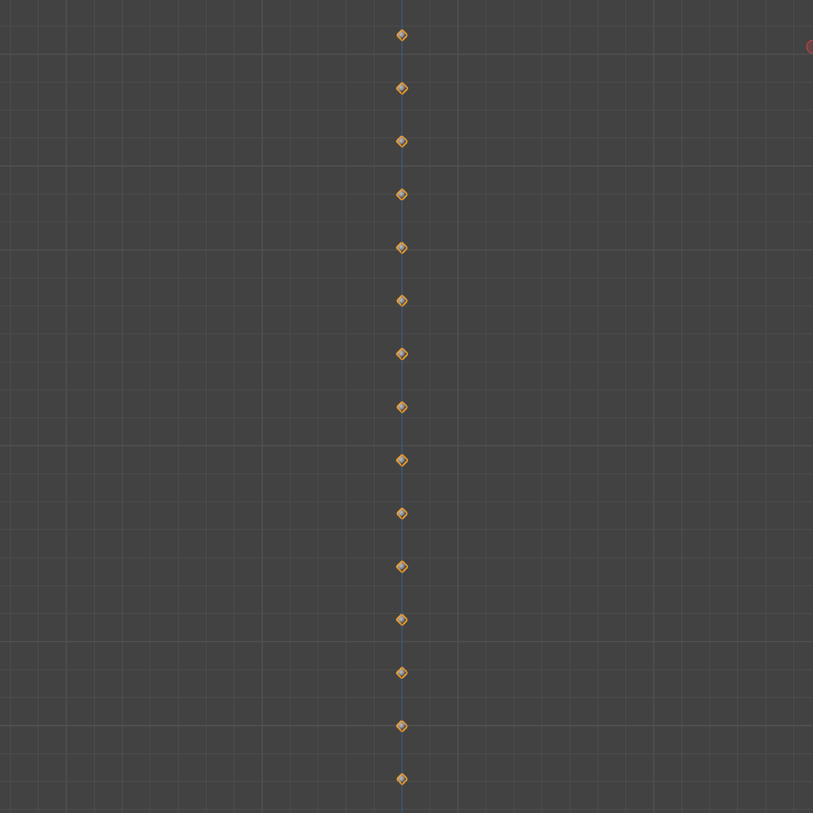
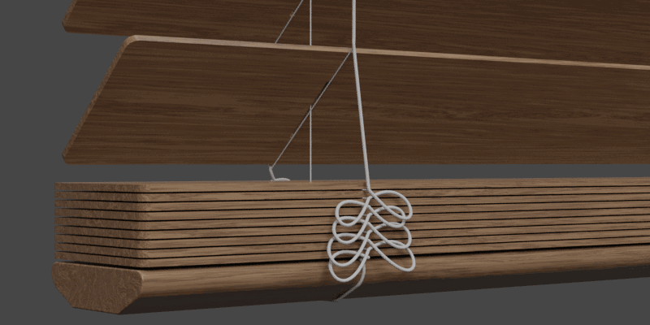
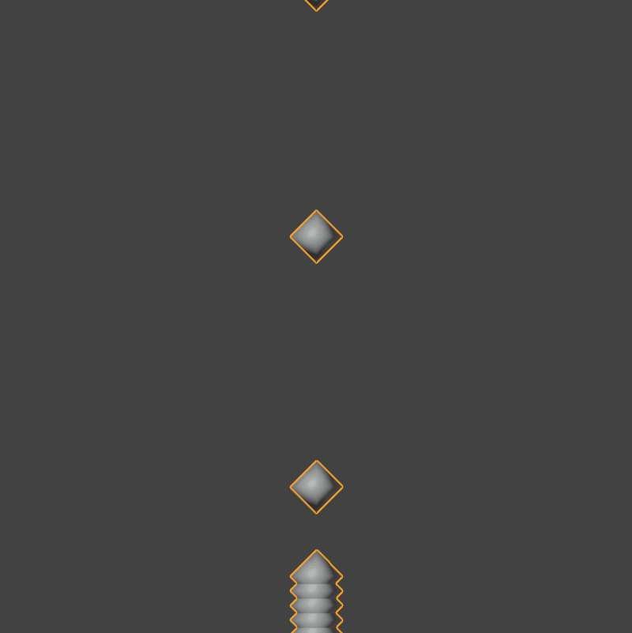
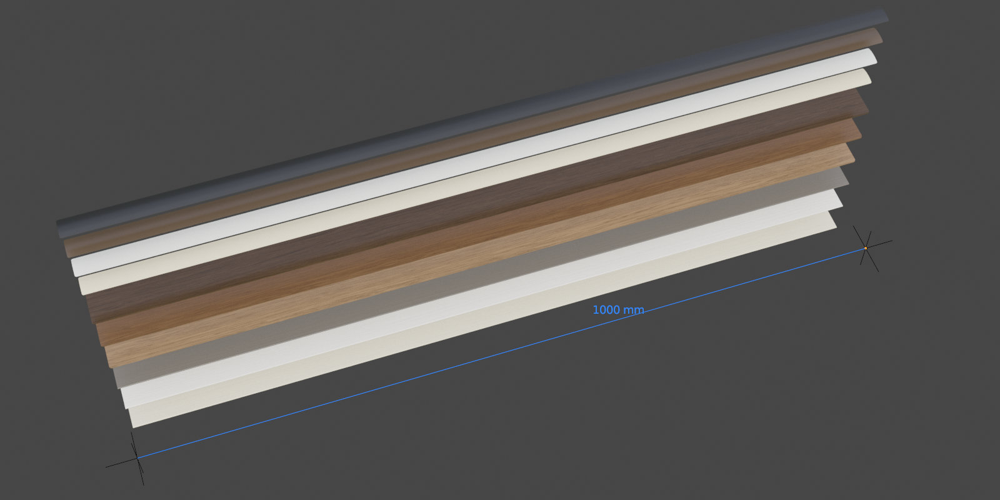
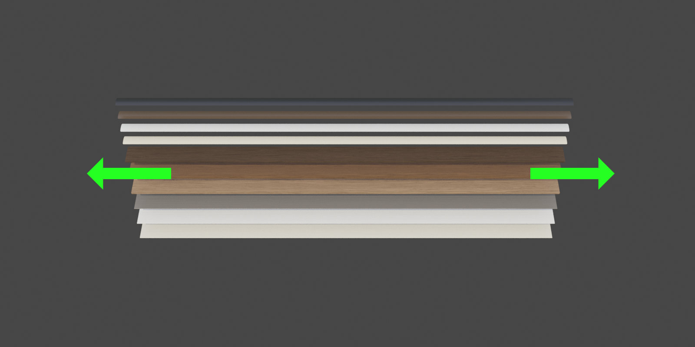
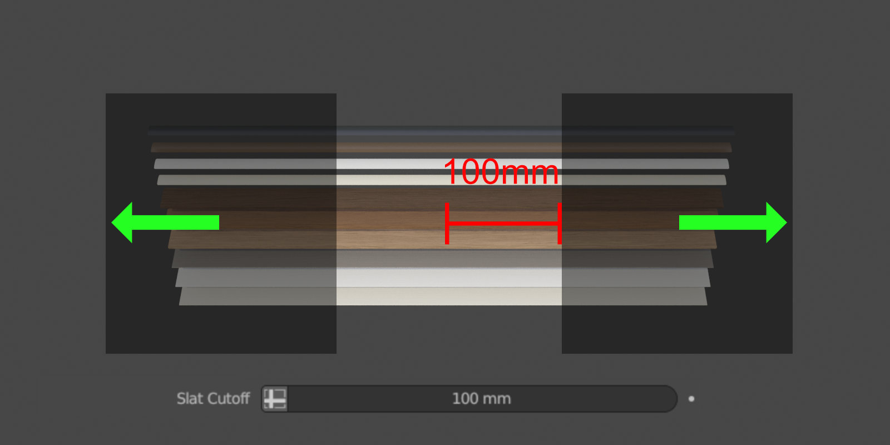
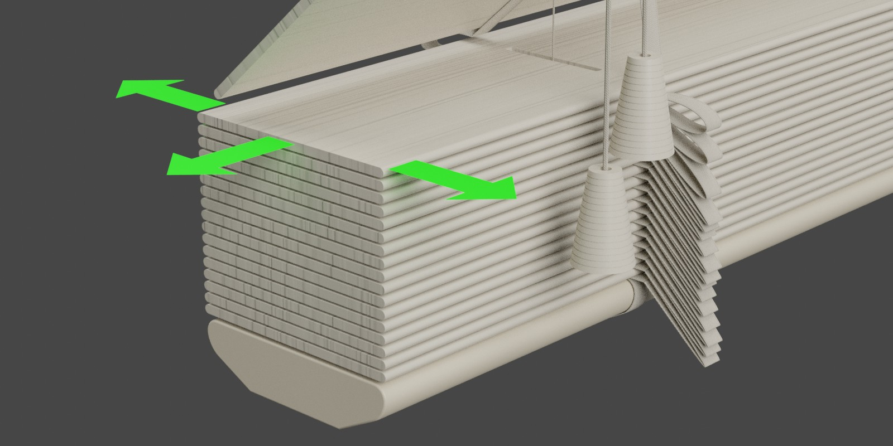
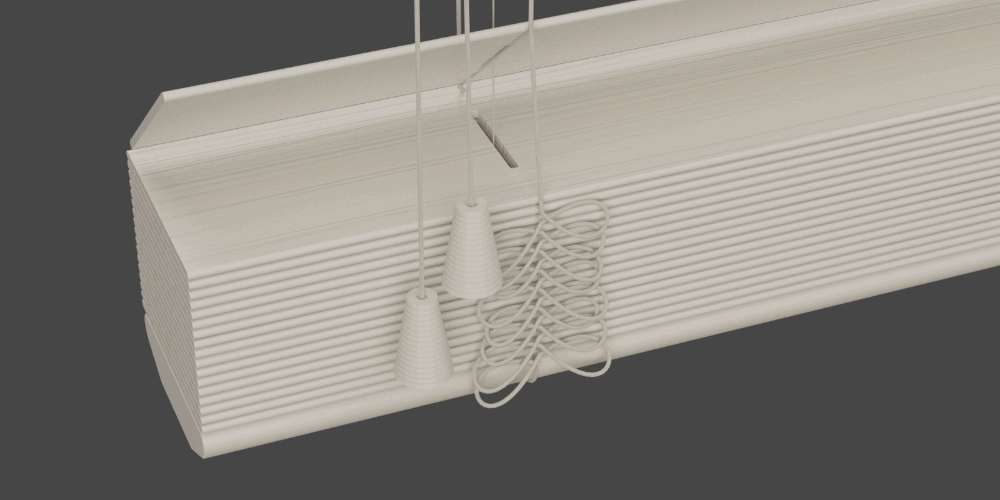

Settings - Slat
====

|

Slat Dimensions
~~~~

Slat Object
----

This is where you choose the object that represents a slat in your blind.

|

Slat Spacing
----

Set the distance between slats.

.. image:: img/VBK_SlatSpacing.gif

|

Stack Thickness
----

This number represents the stack distance of the slat objects. Set it to your slat thickness plus a little for an air gap.

|

Slat Turning Point
----

This is the distance from the bottom that the slat starts to turn from its set rotation to its stacked rotation (0°). 

|

Slat Smoothing Distance
----

Adjust this value to soften the impact that the slat has when stacking.

|

Slat Base Width
----

Set this value to the dimension of the modeled slat object.

|

Slat Extend
----

Turn this value off if you don't want to have the slat extended. Eg. you have an object modeled to a specific size and should not be stretched.

|

Slat Cutoff
----

This is the exact point meaasured from the center that you want to have the slat object extend from.

|

Slat Offset
----

Offset the position of your slat object if the origin is somewhere other than centered.

|

Slat Hole Dimensions
~~~~

Slat Hole Punch
----

VBK can punch holes in your slats for you. Turn this off if you've already modeled the holes in your slat model.

|

Slat Hole Height
----

If you are punching holes in the slats, this is the height (Y axis) of the hole.

|

Slat Hole Width
----

This is the width (X axis) of the hole.

|

Slat Hole Radius
----

This is the radius of the corner bevel of the slat hole.

|

Slat Hole Curvature Count
----

This is the count of the curvature on the corner bevel.

|

