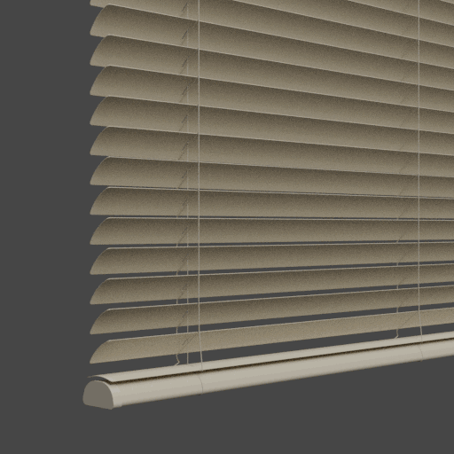

Settings - Slat
====

|

Slat Dimensions
~~~~

Slat Object
----

|

Slat Spacing
----

|

Stack Thickness
----

|

Slat Turning Point
----

|

Slat Smoothing Distance
----

|

Slat Base Width
----

|

Slat Extend
----

|

Slat Cutoff
----

|

Slat Offset
----

|

Slat Hole Diemsions
~~~~

Slat Hole Punch
----

|

Slat Hole Height
----

|

Slat Hole Width
----

|

Slat Hole Radius
----

|

Slat Hole Curvature Count
----

|

