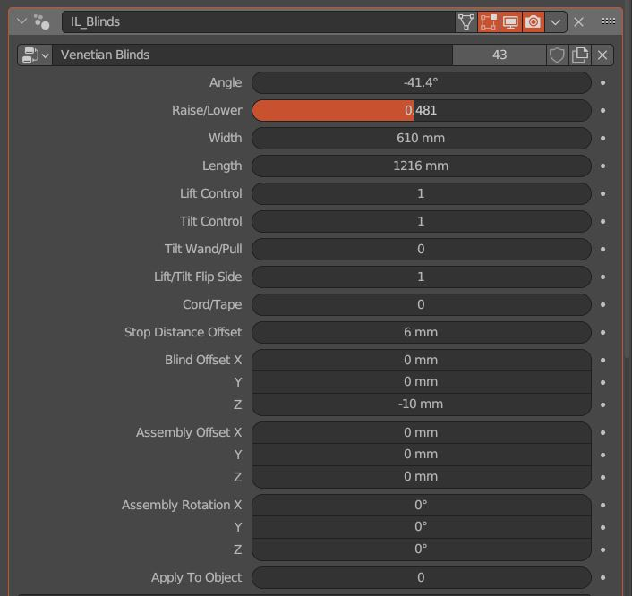
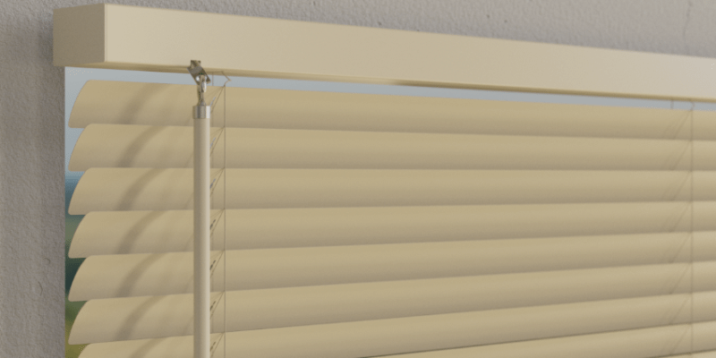
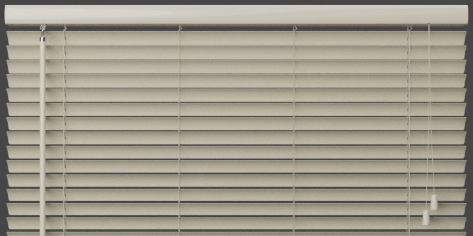
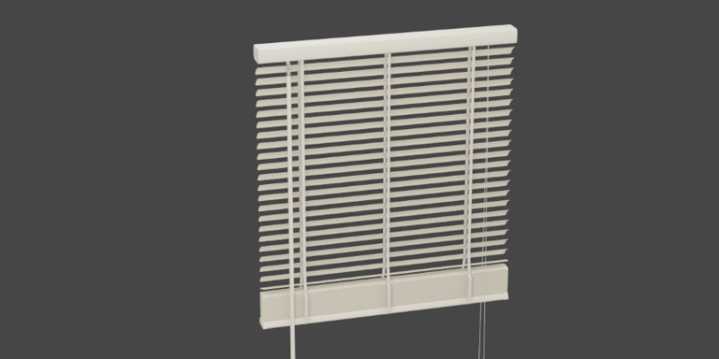
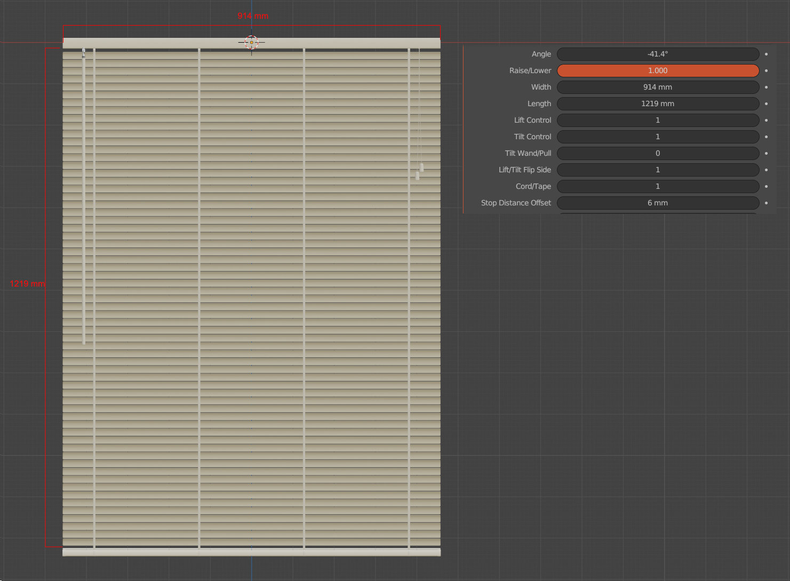
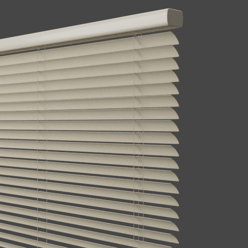
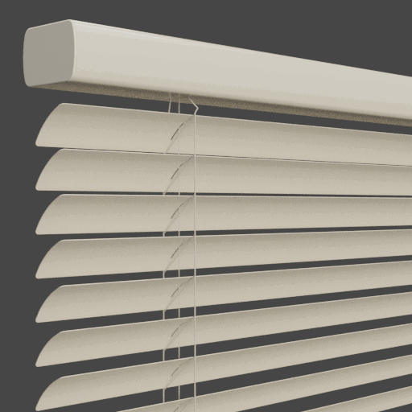
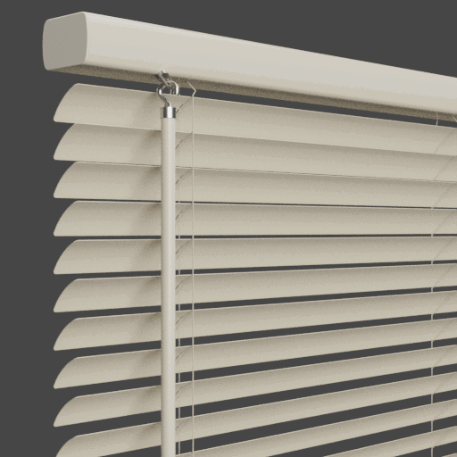
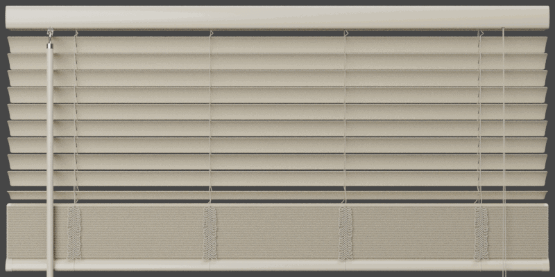
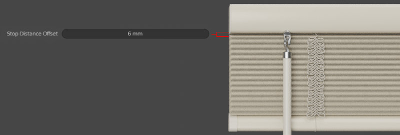

Basic Usage
====

All of the parameters that you need for basic operation are located in the top section of the Geometry Nodes modifier.

|

|

Angle
~~~~

Use this value to set the angle of the slats in degrees. Range is from -90° to 90°.

|

Raise/Lower
~~~~

Value from 0-1, raised fully to fully extended. This amount is also affected by the Stop Distance Offset value.

|

Width
~~~~

The desired width of the blinds. This value respects the unit system of the blender file.

|

Length
~~~~

The desired length of the blinds when fully extended. For best results, set this value to something divisible by the slat spacing. This value respects the unit system of the blender file.

|

Lift Control
~~~~

Show or hide the lift control object. Turn it off for blinds that are pulled down via the bottom rail as a handle.

|

Tilt Control
~~~~

Show or hide the tilt control object.

|

Tilt Wand/Pull
~~~~

Change whether the tilt control is a wand or a pull.

|

Lift/Tilt Flip Side
~~~~

Change which side the tilt and lift controls are located.

|

Cord/Tape
~~~~

Change whether the ladder is cord or tape.

|

Stop Distance Offset
~~~~

Specify how far from the headrail the blind should stop.

|

Blind Offset
~~~~

Offset the blind from the headrail.

|

Assembly Offset
~~~~

Offset the entire assembly from the origin.

|

Assembly Rotation
~~~~

Rotate the entire assembly from the origin.

|

Apply To Object
~~~~

The resulting geometry will be based on instances for better performance. If you plan to export the object, you can turn on this setting to output a single mesh.

|
